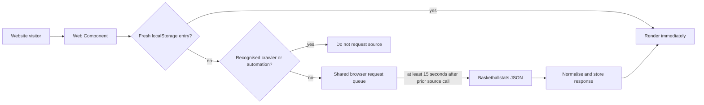

# NBB Stats Generator

A visual configurator for copy-and-paste Basketballstats games and standings
widgets. It is designed for clubs whose website can accept an HTML/code block
but cannot run another backend service.

The project deliberately has two data paths:

| Context | Data source | Protection |
| --- | --- | --- |
| Configurator live preview | `nbb-stats` server client | Shared SQLite cache, source-aware refresh schedule, global 15-second upstream queue |
| Generated club embed | Basketballstats JSON | Per-site/per-browser `localStorage`, one shared 15-second source queue, duplicate-call coalescing, crawler checks |

The generated code loads the standalone widget script from NBB Stats Generator.
The script then requests only JSON data from Basketballstats; it never uses the
generator preview API.

> This is community-maintained software and is not an official product of
> Basketball Nederland or Basketballstats. Basketballstats and its data feeds
> are maintained by Jaap Voets.

## How the generated embed works



- Games and standings share one request timestamp, even though their JSON URLs
  use different Basketballstats subdomains.
- Matching concurrent requests are collapsed into one promise.
- Tabs share the queue when the browser supports the Web Locks API.
- Presentation-only changes—theme, layout, result/upcoming filter, venue, and
  item limit—reuse the same source response.
- Historical seasons have a permanent browser TTL.
- Current-season entries remain fresh until the next source import has had time
  to finish: `00:30 Europe/Amsterdam` daily, plus `17:00` on weekends.
- Stale data is rendered while a permitted refresh runs in the background.

`localStorage` is scoped to one website origin and browser profile. It prevents
repeat traffic from that visitor; it is not a shared edge cache. A first visit
from each new browser can still make a source request.

## Generated code

The configurator produces markup like this:

```html
<script defer src="https://nbb-gen.hashimkarim.com/nbb-stats-widget.js"></script>
<nbb-games
  club-id="57"
  season="2026-2027"
  locale="nl"
  theme="auto"
  accent="#ef4b23"
  layout="cards"
  limit="7"
  venue="all"
  view="upcoming"
></nbb-games>
```

This can be pasted directly into a WordPress Custom HTML block, an Elementor
HTML widget, a Squarespace Code block, or any page that permits scripts and
custom elements. The script executes in the club website's browser context, so
its `localStorage` cache and shared 15-second request timestamp belong to that
website origin—not to the generator.

### Games attributes

| Attribute | Required | Values / meaning |
| --- | --- | --- |
| `club-id` | yes | Basketballstats club ID |
| `season` | yes | `YYYY-YYYY` |
| `team-id` | no | Limit the source/query to one team |
| `competition-id` | no | Limit the source/query to one competition |
| `view` | no | `upcoming`, `results`, or `all` |
| `venue` | no | `home`, `away`, or `all` |
| `limit` | no | Maximum rendered games; default `7` |
| `layout` | no | `cards` or `table` |

### Standings attributes

| Attribute | Required | Values / meaning |
| --- | --- | --- |
| `club-id` | yes | Club highlighted by default |
| `season` | yes | `YYYY-YYYY` |
| `competition-id` | yes | Basketballstats competition ID |
| `highlight-club-id` | no | Club row to highlight |
| `layout` | no | `table`, `bars`, or `combined` |
| `records` | no | Show W-L-D fields supplied by the standings JSON |

Both elements support `locale="nl|en"`, `theme="auto|light|dark"`, and any
valid CSS colour in `accent`.

## Run locally

Requirements: Node.js `22.5` or newer.

```bash
npm install
npm run dev
```

Open <http://localhost:4173>. The preview endpoint uses `nbb-stats` and creates
its durable SQLite cache at `.data/nbb-stats.sqlite`.

Run the complete verification suite with:

```bash
npm run check
```

## Build artifacts

```bash
npm run build
```

This produces:

- `dist/site/` — the configurator frontend;
- `dist/site/nbb-stats-widget.js` — the standalone browser widget served by the
  generator deployment;
- `dist/server/index.js` — the Node server for the configurator and its cached
  preview API.

To use a different script location in generated snippets, set
`VITE_NBB_WIDGET_SCRIPT_URL` before building. Production output defaults to:

```text
https://nbb-gen.hashimkarim.com/nbb-stats-widget.js
```

## Run the configurator with Docker

```bash
docker compose up --build
```

The example Compose stack exposes port `4173` and stores the NBB-Stats SQLite
cache in the `nbb-cache` volume. Configure a real contact value before making
source requests.

Every push to `main` also publishes `linux/amd64` images to
`ghcr.io/hashim-k/nbb-stats-generator` with immutable `main-<commit>` and
moving `latest` tags. [`deploy/compose.yml`](deploy/compose.yml) is the Dockge
deployment template used by `nbb-gen.hashimkarim.com`.

Environment variables:

| Variable | Default | Purpose |
| --- | --- | --- |
| `NBB_CONTACT` | repository URL | Contact identifier sent by the NBB-Stats client |
| `NBB_CACHE_FILE` | `.data/nbb-stats.sqlite` | Persistent preview cache |
| `NBB_UPSTREAM_INTERVAL_MS` | `15000` | Minimum interval; values below 15 seconds are rejected |
| `NBB_ALLOWED_ORIGINS` | empty/public | Optional comma-separated preview-origin allowlist |
| `HOST` | `0.0.0.0` | Node listener |
| `PORT` | `4173` | Node listener |

The preview route is `GET /api/nbb-stats`. It accepts browser requests only,
rate-limits clients, and puts recognised crawlers into cache-only mode.

## Browser and bot boundary

The generated script checks common crawler user agents, `navigator.webdriver`,
Web Storage, and browser APIs before it can call the source. The preview API
also checks `Origin` and Fetch Metadata headers.

These controls stop normal crawlers and accidental command-line use. They
cannot cryptographically prove that a caller is a human browser: user-agent and
request headers can be forged, and CORS is enforced by browsers rather than by
non-browser clients. Strong enforcement would require an authenticated proxy or
edge service, which is intentionally not a requirement for generated embeds.

## Source etiquette

This project uses the compact JSON endpoints only. It never retrieves the
resource-intensive HTML standings/graph page. Please keep the 15-second source
queue and scheduled cache boundaries intact when extending the widget.

## License

[MIT](LICENSE)
